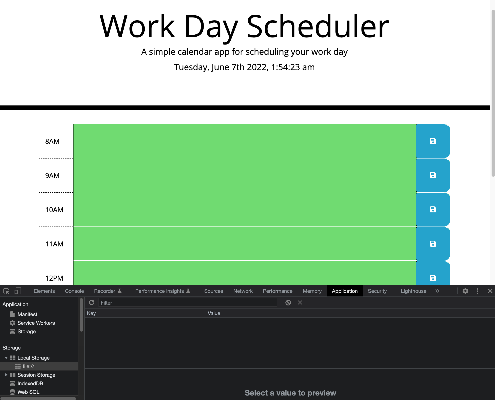
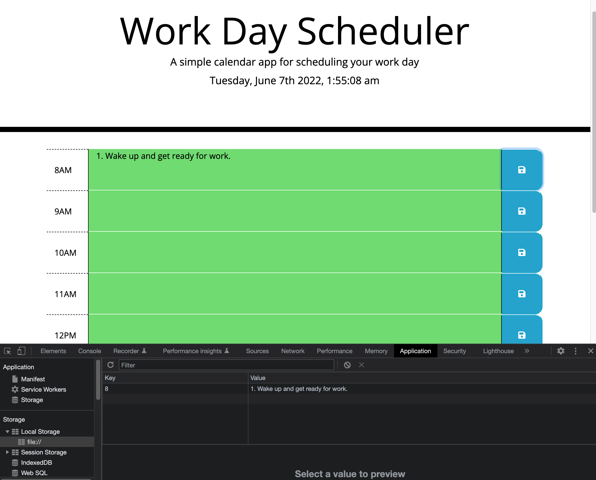

# Work Day Scheduler

## Description

### What This Does

```md
AS AN employee with a busy schedule
I WANT to add important events to a daily planner
SO THAT I can manage my time effectively
```

### Technology Used

- JavaScript

  - Set up Jquery
  - Using moment()
  - Using siblings()

  - Modify classes with JQUERY
  - Get and Set data from local storage

## Features in Work Day Scheduler

```md
GIVEN I am using a daily planner to create a schedule
WHEN I open the planner
THEN the current day is displayed at the top of the calendar
WHEN I scroll down
THEN I am presented with timeblocks for standard business hours
WHEN I view the timeblocks for that day
THEN each timeblock is color coded to indicate whether it is in the past, present, or future
WHEN I click into a timeblock
THEN I can enter an event
WHEN I click the save button for that timeblock
THEN the text for that event is saved in local storage
WHEN I refresh the page
THEN the saved events persist
```

## Screenshots




## Links and Credits

- [Sibling( )](https://www.w3schools.com/jquery/jquery_traversing_siblings.asp)
- [.click( ) jquery](https://api.jquery.com/click/)
- [Using Math.random( ) in JavaScript](https://josephcardillo.medium.com/using-math-random-in-javascript-c49eff920b11)
- [set / get item from local storage](https://stackoverflow.com/questions/40791207/setting-and-getting-localstorage-with-jquery)
- [.val( )](https://api.jquery.com/val/)
